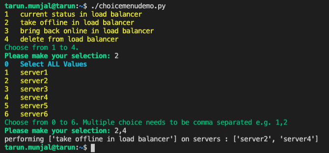

# Class Choice Menu
## Description

This packages can be to provide a choice menu so that the executing user can select from a list of options provided to them.

Incoming object can be a list, tuple or a dictionary object. Once the choice is made either a a list or dict will be returned based upon input object. The script will create a on screen menu for user to choose the items that were in the input object. User has the option to choose all by selecting 0 or they can specify one or more comma separated `int` values `e.g 1,3,5,7,9`.

## Arguments
The Class takes three arguments. First is the object that has the items to choose from. Second argument `multichoice default is True` is to specify if multiple items can be selected or not. Third opiton `maxtries default is 10` is to allow retries in case of a bad input from the user.
- input_object (A python list, tuple or dict object containing items to choose from.)
- multichoice (Default is `True`. Set it to `False` if only one item is allowed from the choice.)
- maxtries (Default is 10. Keep asking the user for valid input for this manu times before raising exception.)

## Example
Please see class module.

# Choice Menu in action screenshot

